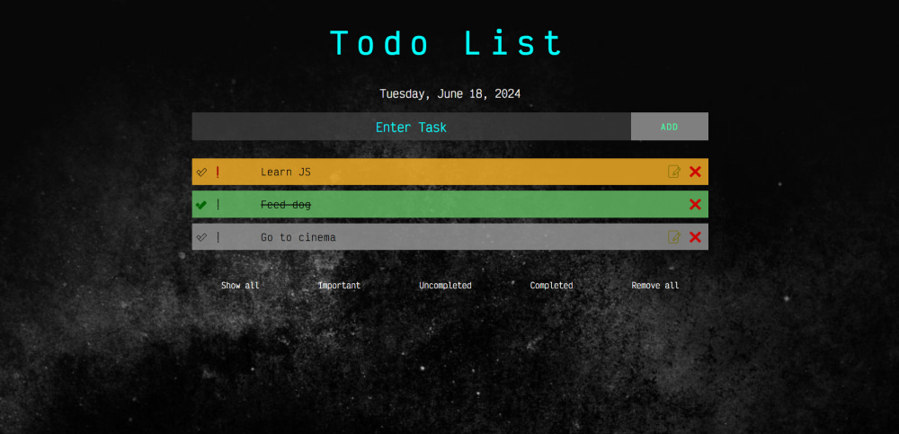
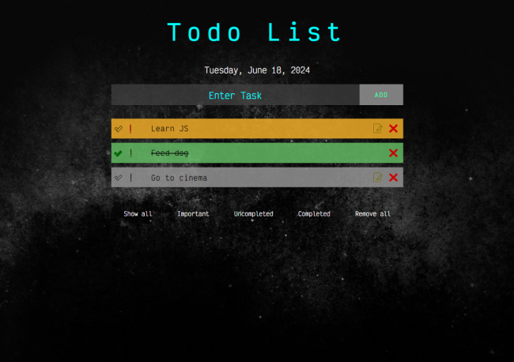
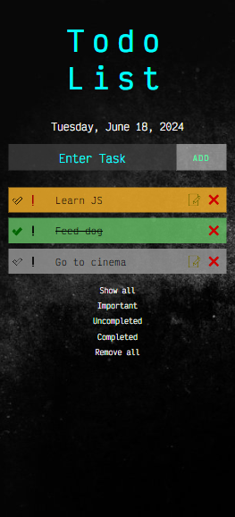

# Todo List MVC

### Description

*This is pet-project about web-application - Todo List.* 
 
You can create your customizing Todo-List. In the web-app you can enter your tasks, mark important tasks, sort, edit and remove it, if necessary. 
During this pet-project I used HTML (template), CSS *(Flexbox)*, JavaScript *(MVC architecture)* languages and tools.
This web page is fully adaptive for all devices. Below you can see screenshots of desktop, tablet and mobile versions.

### Preview

 
